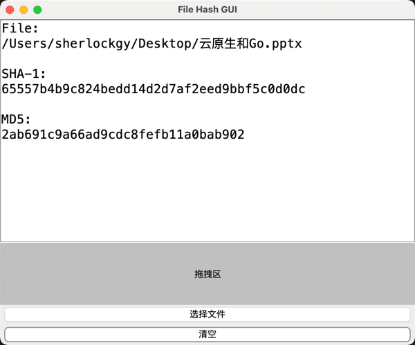

# File Hash GUI

## 功能描述
获取文件 sha1 和 md5 值的 GUI 工具

## 算法描述
SHA-1（英语：Secure Hash Algorithm 1，中文名：安全散列算法1）是一种密码散列函数，美国国家安全局设计，并由美国国家标准技术研究所（NIST）发布为联邦资料处理标准（FIPS）。SHA-1 可以生成一个被称为消息摘要的 160 位（20 字节）散列值，散列值通常的呈现形式为 40 个十六进制数。

MD5 消息摘要算法（英语：MD5 Message-Digest Algorithm），一种被广泛使用的密码散列函数，可以产生出一个 128 位的散列值（hash value），用于确保信息传输完整一致。一般128位的 MD5 散列被表示为 32 位十六进制数字。
